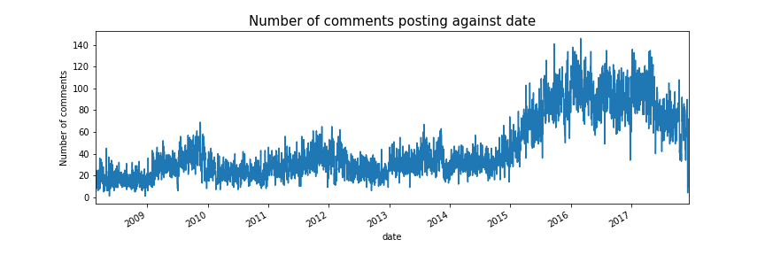
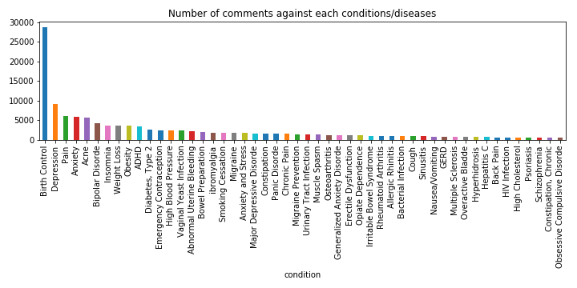
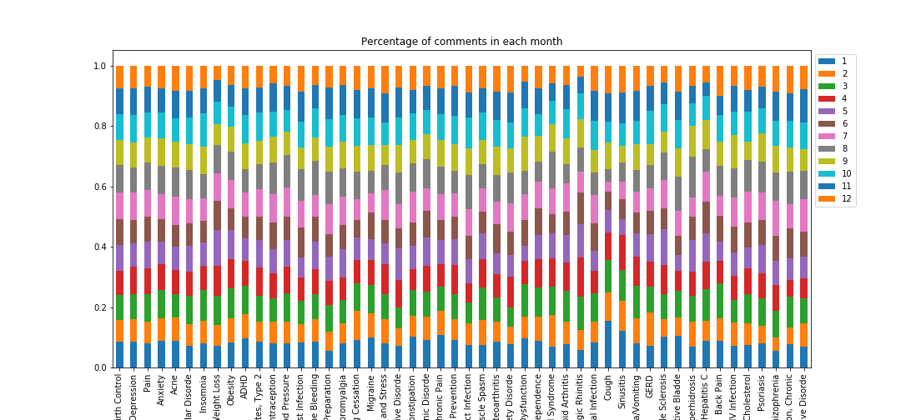

# Sentiment Analysis of prescription drugy reviews and key words of side effects extraction
## Motivation
- This is the first business project hold by Good Grug Medical, a startup data analysis company.  The dataset used in this project provides patient reviews on specific drugs along with related conditions and a 10 star patient rating reflecting overall patient satisfaction. The data was obtained by crawling online pharmaceutical review sites  (Druglib.com). 
- Sentiment Analysis of these reviews could be useful for pharmacy companies and doctors to quickly get into bad reviews and know patients' complains. Also, a lot of symptoms and drug sides were hiden under reviews, which will be great to be automatically extracted to improve the drug and help to give a better prescription. 
- We try to utilize this dataset to do data mining for patient behavior and drug effectiveness in order to provide useful information to patients, doctors and pharmacy companies.

## Target
- Find diseases with significantly seasonal variations based on dates of posting comments.  
- Train the model to predict sentiment of reviews as “Positive”, “Negative”, and “Neutral” based on vectorized words from patients’ comments.
- Explore side effects from patients’ comments.

## EDA
- The number of comments posted had a trend of increasing with time seires. The website probably became more popular after 2015. 

   

- The number of comments for each condition/disease was unbalanced. We had a extremely high number of comments for birth control.

   

### Find conditions/diseases with significantly seasonal variations
- The figour below showed the percentage of comments for the top 50 conditions with the most comments among 12 months. Several of them obviously presented some preference on distinct months, such as weight Loss and cough.	

   

- Chi-squared test was used to determine whether there is a significant difference between the expected frequency and the observed frequencies. The expected frequency here was assumed to be the frequency of all conditions/diseases among 12 months and the observed frequency of each condition was then compared to it. The resulting p-value was adjusted using fdr correction.
H0: The frequency of the condition/disease in 12 months have no difference with that the expected frequency.
H1: The frequency of the condition/disease in 12 months have difference with that the expected frequency.

|condition|statistic|pvalue|adj_pvalue|
|---|---|---|---|
|Weight Loss|145.652500|1.149992e-25|9.297688e-24|
|Cough|129.962039|1.771886e-22|7.162849e-21|
|Allergic Rhinitis|89.940100|1.712822e-14|4.616054e-13|
|Sinusitis|72.581047|3.936670e-11|7.956994e-10|
|Cough and Nasal Congestion|71.094673|7.562344e-11|1.222831e-09|
|Herpes Simplex|57.745517|2.424612e-08|3.267165e-07|
|Obesity|54.759136|8.577515e-08|9.907030e-07|
|Insomnia|53.858426|1.252668e-07|1.265978e-06|
|Bronchitis|50.674949|4.731868e-07|4.250795e-06|
|Vaginal Yeast Infection|48.344293|1.239355e-06|1.002018e-05|

