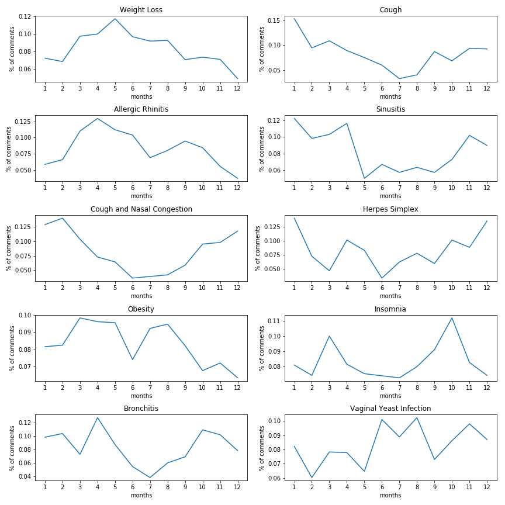
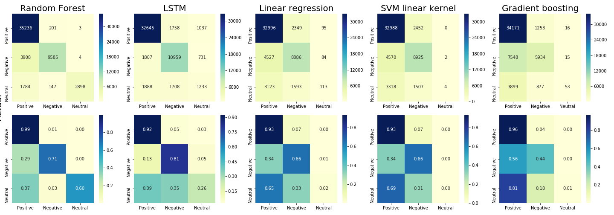
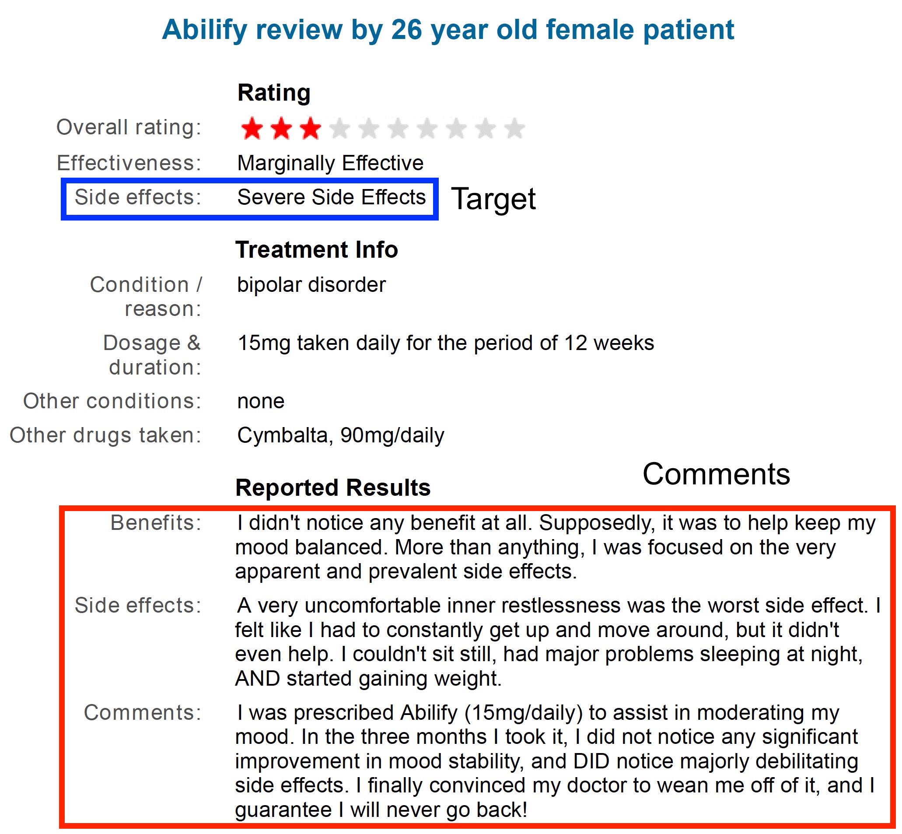
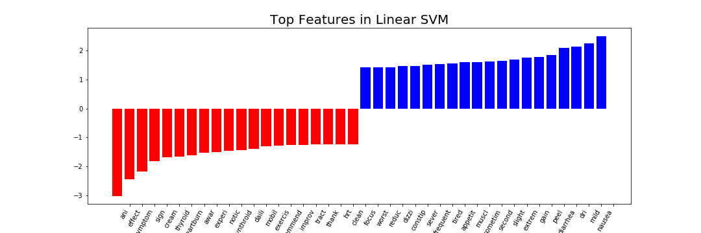

# Sentiment Analysis of prescription drugy reviews and key words of side effects extraction
## Motivation
- This is the first business project hold by Good Grug Medical, a startup data analysis company.  The dataset used in this project provides patient reviews on specific drugs along with related conditions and a 10 star patient rating reflecting overall patient satisfaction. The data was obtained by crawling online pharmaceutical review sites  (Druglib.com). 
- Sentiment Analysis of these reviews could be useful for pharmacy companies and doctors to quickly get into bad reviews and know patients' complains. Also, a lot of symptoms and drug sides were hiden under reviews, which will be great to be automatically extracted to improve the drug and help to give a better prescription. 
- We try to utilize this dataset to do data mining for patient behavior and drug effectiveness in order to provide useful information to patients, doctors and pharmacy companies.

## Target
- Find diseases with significantly seasonal variations based on dates of posting comments.  
- Train the model to predict sentiment of reviews as “Positive”, “Negative”, and “Neutral” based on vectorized words from patients’ comments.
- Explore side effects from patients’ comments.

## EDA
- The number of comments posted had a trend of increasing with time seires. The website probably became more popular after 2015. 

   

- The number of comments for each condition/disease was unbalanced. We had a extremely high number of comments for birth control.

   

### Find conditions/diseases with significantly seasonal variations
- The figour below showed the percentage of comments for the top 50 conditions with the most comments among 12 months. Several of them obviously presented some preference on distinct months, such as weight Loss and cough.	

   

- Chi-squared test was used to determine whether there is a significant difference between the expected frequency and the observed frequencies. The expected frequency here was assumed to be the frequency of all conditions/diseases among 12 months and the observed frequency of each condition was then compared to it. The resulting p-value was adjusted using fdr correction. 
 H0: The frequency of the condition/disease in 12 months have no difference with that the expected frequency.
 H1: The frequency of the condition/disease in 12 months have difference with that the expected frequency.  
  Top 10 conditions with lowest adjusted p-values

   |Condition|Statistic|p-value|adjusted p-value|
   |---|---|---|---|
   |Weight Loss|145.652500|1.149992e-25|9.297688e-24|
   |Cough|129.962039|1.771886e-22|7.162849e-21|
   |Allergic Rhinitis|89.940100|1.712822e-14|4.616054e-13|
   |Sinusitis|72.581047|3.936670e-11|7.956994e-10|
   |Cough and Nasal Congestion|71.094673|7.562344e-11|1.222831e-09|
   |Herpes Simplex|57.745517|2.424612e-08|3.267165e-07|
   |Obesity|54.759136|8.577515e-08|9.907030e-07|
   |Insomnia|53.858426|1.252668e-07|1.265978e-06|
   |Bronchitis|50.674949|4.731868e-07|4.250795e-06|
   |Vaginal Yeast Infection|48.344293|1.239355e-06|1.002018e-05|
   
- The figure below showed the frequencies of top 10 conditions with lowest adjusted p-values among 12 months, indicating obvious seasonalities.

   

## Modeling for sentiment analysis of drug reviews
- The 215,063 patients' comments were provided together with rating ranging from 0 to 10. Here, I assigned the rating into three categories “Positive” (<= 4), “Negative” (>=7), and “Neutral” (>4 and <7) in order to avoild bias from personal influence. The words in comments were cleaned, stemmized and vectorized using tf-idf. 
- The dataset was then trained using Logistic regresssion, SVM, Random forest and Gradient boosting as well as embeding plus LSTM. The resulting confusion matrixes were listed below.

   

## Modeling for identification of comments with side effects
- It will also be very suggestive to drug pharmacy companies if I can build a model to filtering comments and quickly selecting patients' complains about side effects. However, the dataset used above didn't really contained the label of "with/without side effects". So web scraping is applied to extract comments and this type of labe from druglib.com, leading to total 4160 records. 

    

- tf-idf vecterization with Logistic regresssion, SVM, Random forest and Gradient boosting as well as embeding plus LSTM were applied to train data. LSTM here gave a highest performance about 84.3% accuracy, 9% higher than the seconde one, SVM with linear kernel (75.4%).

|   ROC curve             |  Model   | Accuracy | ROC-AUC|
|:-----------------------:|:-------------------------:|:-------------------------:|-------------------------:|
|  |  Logistic regresssion SVM linear SVM rbf Random forest   Gradient boosting  LSTM|0.73 0.75 0.68 0.71 0.72  0.86|0.78   -   -   0.79   0.77   0.84|

- Despite of the best performance, the model trained using LSTM is always hard to interpret. So we also looked into the second best model built by SVM using linear kernel. The figure below showed words with the top highest and lowest coefficients in the linear SVM model, which contributed to maximizing the margin and determining the boundary of two classes.

    

Top words in the linear SVM appeared to be related to description of some discomfort (e.g. "nausea", "dry", "diarrhea", "heartburn") dizzi"). However, these words could be ambiguous and included both symptoms and side effects, probably disturbing classification and resulting in a relatively lower performance. LSTM, as a special kind of RNN, is able to maintain some "memories" for forward/backworad words and likely to better "understand" the whole sentence. 
 

- Comments of benefits, side effects and others were separated in this data set, which could be distinct to usual comments online. Despite three types of comments were incorporated for training, I still believe it should be neccesary to use the models to predit the other dataset with no label of side effects (used in the last section) in order to test the models in the real world. 

   The accuracies were estimated by artificial reading 10 randomly sample records. Obviously, the LSTM model helped to identity more ture negative (no side effects) than random selection despite of similar performance on true postive. If adding more comments with labled of side effects in the future, it is very possible to achieve a better model.

   |model|TP|TN|
   |---|---|---|
   |LSTM|6.5|7.5|
   |SVM|5.5|6|
   |Random|6|3|
   
   Some comments predicted by LSTM
   
   |LSTM| Predited to have side effect | Predited to have no side effect|
   |---|---|---|
   |1|it work veri well but it caus excess drowsi and also made me gain a lot of weight in a short period of time i took it for almost a year befor i switch to someth els|my hemorroid are gone thank you|
   |2|start victoza week ago and lost pound so far my stomach was a littl upsetbut i find that eat more alkalin food rather lot of acid food help tremend|i just start the pill in the morn and one pill at night today i have had no effect whatsoev other than feel tire i have lost no weight and am hungri all the time i will continu it but not for much longer veri disappoint|
   |3|work great and doe not caus erectil dysfunct like other class of blood pressur drug|wonder veri quick act like two hour so watch out for that solv the problem when all els fail expens|
   |4|klonopin was great for help me manag anxieti and panic attack almost all medicin carri warn about alcohol consumpt so mani peopl like me and assum that moder alcohol consumpt is okay and that warn are just to limit liabil of the manufactur if someon drink and has an incid warn do not drink alcohol if you are take this medic i did and had what i now consid to be a near death experience&quot i found myself in a public restroom stall and liter unabl to move for what seem like hour i rememb feel my heart beat what seem like onc everi  second and i couldnt even call out for help becaus i liter could not speak i now feel veri lucki to have surviv|i have been suffer with cold sore my whole life noth i tri everyth work like this i was veri skeptic about purchas it becaus it is expens for the littl tube i am so glad i did if you put it on as soon as you notic or feel oneven come it will stop it from grow ani bigger or make it disappear complet|
   |5|i find that if i take the ambien and go direct to bed it work veri well if i take it and then delay go to bed by do dish or clean befor bed i have unusu effect after sleep for a veri short period of time i will get up go to the kitchen and make waffl this has happen a hand of time im alway surpris to have my famili thank me for take the troubl for make waffl realli no troubl sinc i dont rememb ani of it|i have use imitrex by autoinject sinc it first came out after year of migrain take my day away this tini inject allow me to take it back unlik the other medicin i take this at first onset and  min later continu my day on schedul no nap no regret no nausea after initi prescript met with the manufactur rep who help with dose i was pioneer ani new product when this came out wegman pharmacist and my md and the drug rep were great help now shot in each leg right away im lbs|
   
